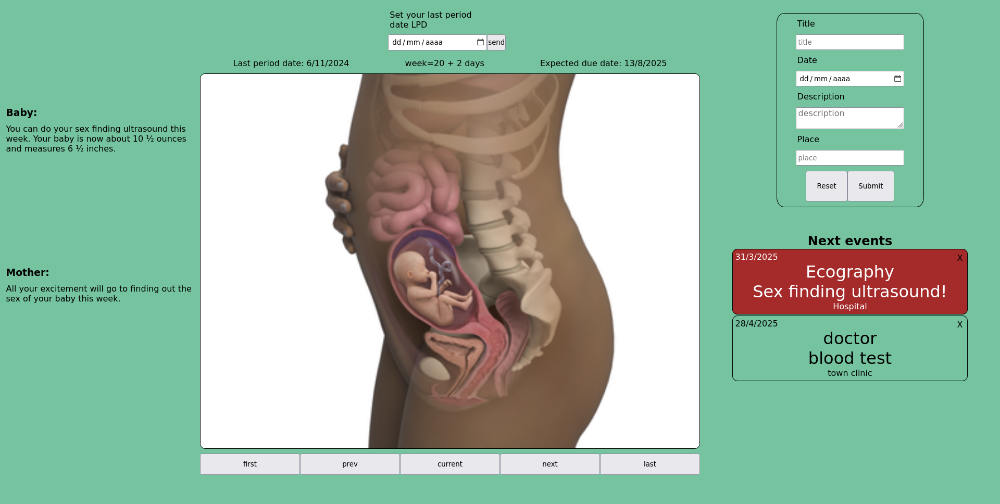

# Pregnancy-tracker

Full stack application for showing info about the pregnancy status and a todo list 

<p align="center">
  
</p>


# Getting started

  Open the console and run:
  
  - in the server folder:
    ```
    npm install
    ```

    ```
    npm run dev  
    ```

  - in the client folder:
    ```
    npm install
    ```

    ```
    npm run dev
    ```
Open the browser and go to  http://localhost:5173/

# Tech stack

* Client: <br>
  <picture></picture>
  <picture></picture>
  <picture></picture>

* Server: <br>
  <picture></picture>
  <picture></picture>
  <picture></picture>
  <picture></picture>
  <picture></picture>
  <picture></picture>

